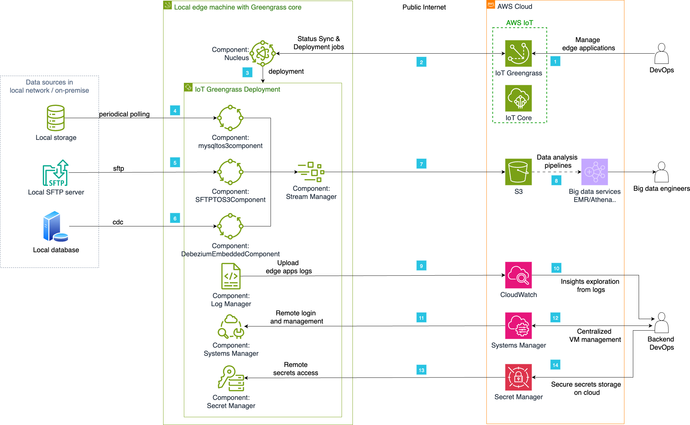

# aws-iot-greengrass-edge-dataconnector
Edge data acquisition solution for database, SFTP servers, storage in local network.

# IoT Greengrass CDC 完整解决方案

这是一个基于AWS IoT Greengrass v2的完整MySQL CDC (Change Data Capture) 数据传输解决方案，专为数据项目设计。

## 🏗️ 架构概述

```
MySQL数据库 → CDC组件 → Stream Manager → Amazon S3
     ↓           ↓            ↓           ↓
  实时变更   → 数据捕获  → 批处理上传 → 云端存储
     ↓
  SFTP服务器 → SFTP同步组件 → Stream Manager → Amazon S3
```
## Architecture diagram


## 📦 组件说明

### 1. Debezium Embedded组件 (`com.example.DebeziumEmbeddedComponent`)
- **功能**: 基于Debezium的实时CDC数据捕获
- **技术**: Java + Debezium Embedded
- **特性**: 实时监听MySQL binlog，捕获数据变更事件
- **输出**: 实时CDC事件流到S3

### 2. MySQL轮询组件 (`com.example.MySQLToS3Component`)
- **功能**: 定时轮询MySQL数据库获取增量数据
- **技术**: Python + MySQL Connector
- **特性**: 基于时间戳的增量数据同步，适合批量处理
- **输出**: 定期批量数据到S3

### 3. SFTP同步组件 (`com.example.SFTPToS3Component`)
- **功能**: 从本地SFTP服务器读取CDC文件并同步到S3
- **技术**: Python + Paramiko
- **特性**: 文件监控、自动同步、错误重试
- **输出**: SFTP文件内容到S3

## 🚀 快速开始

### 前置条件

1. **AWS IoT Greengrass v2已安装并运行**
2. **MySQL数据库已配置并启用binlog**
3. **AWS CLI已配置**
4. **必要的IAM权限**

### 一键部署

```bash
# 1. 克隆或下载项目
cd ab-greengrass-0805

# 2. 配置环境变量
cp config/global-config.env.template config/global-config.env
nano config/global-config.env

# 3. 构建所有组件
./build-all.sh

# 4. 部署所有组件
./deploy-all.sh

# 5. 运行测试验证
./test-all.sh --integration
```

### 分步部署

```bash
# 构建单个组件
./build-all.sh --component debezium-embedded

# 部署单个组件
./deploy-all.sh --component debezium-embedded

# 运行特定测试
./test-all.sh --smoke-test
```

## 📁 项目结构

```
sample-aws-iot-greengrass-edge-data-connector/
├── README.md                           # 项目说明文档
├── build-all.sh                        # 统一构建脚本
├── deploy-all.sh                       # 统一部署脚本
├── test-all.sh                         # 统一测试脚本
├── config/
│   ├── global-config.env              # 全局配置文件
│   └── deployment-template.json       # 部署模板
├── components/
│   ├── debezium-embedded/             # Debezium CDC组件
│   │   ├── src/                       # Java源码
│   │   ├── build.gradle               # Gradle构建配置
│   │   ├── recipe.json               # Greengrass组件配置
│   │   └── debezium.properties       # Debezium配置
│   ├── sftp-to-s3/                   # SFTP到S3组件
│   │   ├── sftp_to_s3.py             # Python源码
│   │   ├── requirements.txt          # Python依赖
│   │   └── recipe.json               # Greengrass组件配置
│   └── mysql-to-s3/                  # MySQL轮询组件
│       ├── mysql_to_s3.py            # Python源码
│       ├── requirements.txt          # Python依赖
│       └── recipe.json               # Greengrass组件配置
├── infrastructure/
│   ├── sftp-server-setup.sh          # SFTP服务器设置
│   ├── mysql-setup.sql               # MySQL初始化脚本
│   └── iam-policies.json             # IAM权限配置
└── tests/
    ├── integration-test.sh            # 集成测试脚本
    └── unit-tests/                    # 单元测试目录
```

## ⚙️ 配置说明

### 全局配置 (`config/global-config.env`)

```bash
# AWS配置
AWS_ACCOUNT_ID="5853xxxxxxxx"
AWS_REGION="ap-northeast-1"
S3_BUCKET="zihangh-gg-streammanager-poc"

# MySQL配置
MYSQL_HOST="localhost"
MYSQL_DATABASE="testdb"
MYSQL_USERNAME="testuser"
MYSQL_PASSWORD="testpassword"

# SFTP配置
SFTP_HOST="localhost"
SFTP_USERNAME="sftpuser"
SFTP_PASSWORD="sftppassword123"

# 组件版本
DEBEZIUM_COMPONENT_VERSION="1.0.6"
SFTP_COMPONENT_VERSION="1.0.3"
MYSQL_COMPONENT_VERSION="1.0.1"
```

### 部署配置 (`config/deployment-template.json`)

支持环境变量替换的部署模板，可以根据不同环境自动生成部署配置。

## 🔧 构建系统

### 构建脚本功能

- ✅ **环境依赖检查**: 自动检查Java、Python、AWS CLI等依赖
- ✅ **并行构建**: 支持多组件并行构建提升效率
- ✅ **语法验证**: 自动验证Python代码和JSON配置文件
- ✅ **构建报告**: 生成详细的构建报告

### 构建选项

```bash
./build-all.sh                          # 构建所有组件
./build-all.sh --component debezium-embedded  # 构建指定组件
./build-all.sh --parallel --release     # 并行发布构建
./build-all.sh --clean                  # 清理构建产物
```

## 🚀 部署系统

### 部署脚本功能

- ✅ **智能部署**: 自动处理组件依赖关系
- ✅ **部署策略**: 支持滚动部署、蓝绿部署等策略
- ✅ **健康检查**: 自动验证部署结果
- ✅ **回滚机制**: 支持快速回滚到上一版本

### 部署选项

```bash
./deploy-all.sh                                    # 部署所有组件
./deploy-all.sh --component debezium-embedded      # 部署指定组件
./deploy-all.sh --environment prod --strategy rolling  # 生产环境滚动部署
./deploy-all.sh --dry-run                         # 模拟部署
./deploy-all.sh --health-check                    # 健康检查
./deploy-all.sh --rollback                        # 回滚部署
```

## 🧪 测试系统

### 测试脚本功能

- ✅ **多层次测试**: 单元测试、集成测试、性能测试、冒烟测试
- ✅ **端到端验证**: 完整数据流测试
- ✅ **连接测试**: MySQL、SFTP、S3、Greengrass连接验证
- ✅ **测试报告**: 生成HTML格式测试报告

### 测试选项

```bash
./test-all.sh --integration                    # 运行集成测试
./test-all.sh --component debezium-embedded    # 测试指定组件
./test-all.sh --full --report                 # 运行所有测试并生成报告
./test-all.sh --smoke-test                    # 快速冒烟测试
./test-all.sh --performance                   # 性能测试
```

## 📊 数据流说明

### 1. 实时CDC流 (Debezium)
```
MySQL binlog → Debezium → Stream Manager → S3
实时性: < 1秒
数据格式: JSON CDC事件
适用场景: 实时数据同步、事件驱动架构
```

### 2. 批量轮询流 (MySQL Polling)
```
MySQL表 → 定时查询 → Stream Manager → S3
实时性: 5分钟 (可配置)
数据格式: JSON批量数据
适用场景: 定期数据备份、批量数据分析
```

### 3. 文件同步流 (SFTP)
```
SFTP文件 → 文件监控 → Stream Manager → S3
实时性: 30秒 (可配置)
数据格式: 原始文件内容
适用场景: 文件归档、数据传输
```

## 🔍 监控和日志

### 组件日志位置

```bash
# Greengrass组件日志
/greengrass/v2/logs/com.example.DebeziumEmbeddedComponent.log
/greengrass/v2/logs/com.example.MySQLToS3Component.log
/greengrass/v2/logs/com.example.SFTPToS3Component.log

# Stream Manager日志
/greengrass/v2/logs/aws.greengrass.StreamManager.log
```

### 监控命令

```bash
# 查看组件状态
sudo systemctl status greengrass

# 实时查看日志
sudo tail -f /greengrass/v2/logs/*.log

# 检查S3数据
aws s3 ls s3://zihangh-gg-streammanager-poc/gg_mysql/ --recursive

# 健康检查
./deploy-all.sh --health-check
```

## 🛠️ 故障排除

### 常见问题

1. **MySQL连接失败**
   ```bash
   # 检查MySQL服务状态
   sudo systemctl status mysql
   
   # 测试连接
   mysql -h localhost -u testuser -ptestpassword -e "SELECT 1;"
   ```

2. **S3上传失败**
   ```bash
   # 检查AWS凭证
   aws sts get-caller-identity
   
   # 测试S3访问
   aws s3 ls s3://zihangh-gg-streammanager-poc/
   ```

3. **组件启动失败**
   ```bash
   # 查看详细错误日志
   sudo journalctl -u greengrass -f
   
   # 重启Greengrass
   sudo systemctl restart greengrass
   ```

### 调试模式

```bash
# 启用详细日志
export LOG_LEVEL=DEBUG

# 运行单个组件测试
./test-all.sh --component debezium-embedded

# 模拟部署检查配置
./deploy-all.sh --dry-run
```

## 📈 性能优化

### 配置调优

```bash
# Java堆内存调整
export JAVA_HEAP_SIZE="1024m"

# Python工作线程数
export PYTHON_WORKER_THREADS="4"

# 批处理大小
export BATCH_SIZE="500"

# 轮询间隔优化
export POLLING_INTERVAL="180"  # 3分钟
```

### 监控指标

- **数据处理延迟**: CDC事件处理时间
- **吞吐量**: 每分钟处理的记录数
- **错误率**: 失败的传输比例
- **资源使用**: CPU、内存、磁盘使用情况

## 🔒 安全考虑

1. **数据库凭证**: 使用AWS Secrets Manager存储敏感信息
2. **网络安全**: 配置VPC和安全组
3. **数据加密**: 启用S3服务端加密
4. **访问控制**: 最小权限原则
5. **审计日志**: 启用CloudTrail记录API调用

## 🤝 贡献指南

1. Fork项目
2. 创建功能分支 (`git checkout -b feature/AmazingFeature`)
3. 提交更改 (`git commit -m 'Add some AmazingFeature'`)
4. 推送到分支 (`git push origin feature/AmazingFeature`)
5. 开启Pull Request

## 📄 许可证

本项目采用MIT许可证 - 查看 [LICENSE](LICENSE) 文件了解详情。

## 📞 支持

如有问题或需要支持，请：

1. 查看[故障排除](#故障排除)部分
2. 运行健康检查: `./deploy-all.sh --health-check`
3. 查看组件日志
4. 提交Issue到项目仓库

---

**AWS IOT Greengrass CDC 解决方案** - 为现代数据架构而生 🚀

## Security

See [CONTRIBUTING](CONTRIBUTING.md#security-issue-notifications) for more information.

## License

This library is licensed under the MIT-0 License. See the LICENSE file.

